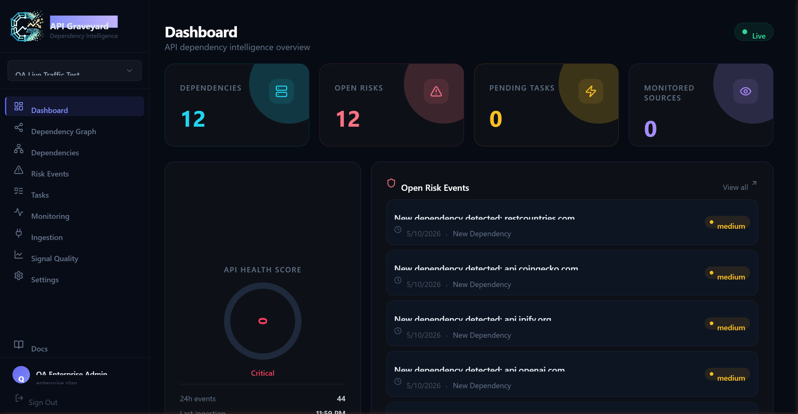
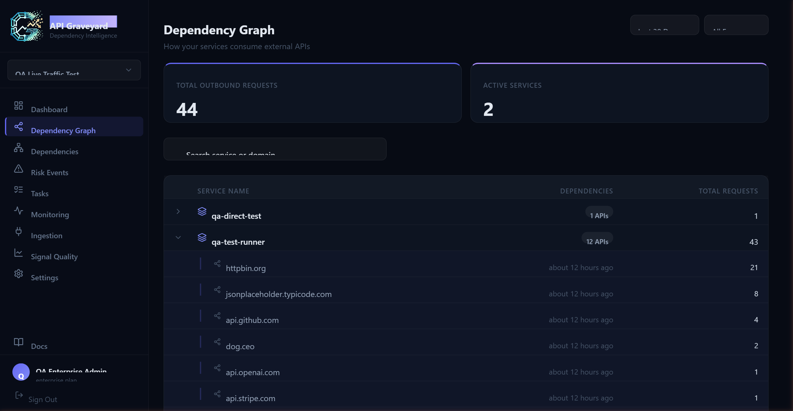
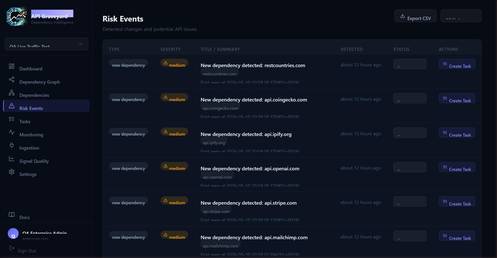
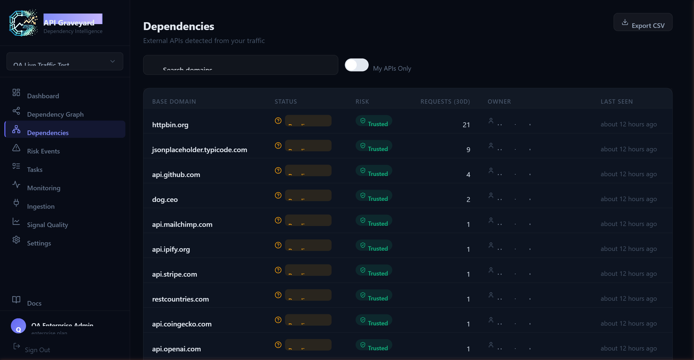
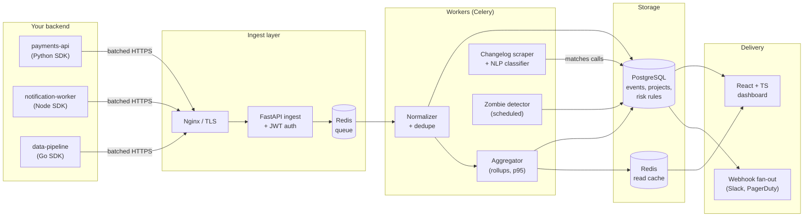

# API Graveyard — Case Study

> **API dependency intelligence for backend teams.** Map what you call, catch breaking changes before deploy, and bury the zombies before they wake up at 3 AM.
>
> Production SaaS — [api-graveyard.com](https://api-graveyard.com) · this repo is a public case study; the product code lives in a private repo.

---

## The problem

Every backend depends on a graveyard of third-party APIs — Stripe for billing, Twilio for SMS, SendGrid for email, an internal `auth-service` from two teams over, that vendor your predecessor integrated and nobody remembers why.

Three things go wrong over and over:

1. **You don't actually know what you depend on.** Ask any backend engineer to list every external HTTP call their service makes and you'll get half the list. The other half lives in a forgotten cron job.
2. **Vendors ship breaking changes quietly.** A header gets renamed, a field becomes required, an endpoint moves from `/v1` to `/v2` — and the announcement is buried in a changelog blog from six weeks ago.
3. **Endpoints quietly die.** A code path stops being called, but the integration, the API key, and the vendor bill all live on for months.

API Graveyard fixes all three.

## What it does

| Capability                  | What it actually means |
|-----------------------------|------------------------|
| **Auto-discover dependencies** | Drop in a 1-line SDK ([Python](https://github.com/Shakargy/api-graveyard-python), [Go](https://github.com/Shakargy/api-graveyard-go), [Node](https://github.com/Shakargy/api-graveyard-node)). Every outgoing HTTP call gets captured. No config. No code changes per endpoint. |
| **Detect breaking changes** | Vendor changelogs are scraped on a schedule. NLP classifies each entry. If your code calls an endpoint that a changelog flagged, you get a risk event before next deploy. |
| **Find Zombie APIs**          | Endpoints that used to be hot and now haven't been called in N days. The thing nobody removes because nobody knows it's dead. |
| **Webhook integrations**      | Push risk events into Slack, PagerDuty, or any webhook. Wire it into your release-gate CI step. |

## Live

- **Product:** [api-graveyard.com](https://api-graveyard.com)
- **SDKs (public):** [Python](https://github.com/Shakargy/api-graveyard-python) · [Go](https://github.com/Shakargy/api-graveyard-go) · [Node.js](https://github.com/Shakargy/api-graveyard-node)
- **Case study:** you're reading it

---

## Screenshots

> Dashboards are populated with realistic demo data (Stripe, Twilio, SendGrid, OpenAI, Slack, Datadog) so you can see how the surface actually reads in production. Real customer data is never shown.

### Dashboard overview

The first thing you see after sign-in. Health at a glance, then the table you actually scan first thing in the morning.

### Dependency graph

Auto-built from the SDK stream. Lines are weighted by 24h call volume; color signals current risk.

### Risk events

Detected changes and potential API issues — new dependencies, breaking changes, and error spikes, each with severity and one-click task creation.

### Dependencies

Every external API discovered from live traffic, with approval status, risk score, request volume, and last-seen timestamp.

---

## Architecture

### How a request flows through the system

1. **Capture** — The SDK monkey-patches the HTTP layer (`urllib3`, `net/http`, `http.Agent`) and buffers events in-process.
2. **Flush** — Every 10s (configurable), the buffer is shipped to `/v1/events/batch` as a single batched HTTPS POST.
3. **Ingest** — FastAPI validates the JWT, schema-checks the batch, drops it on a Redis queue, returns `202 Accepted`. Customer-facing path stays under 50ms p95.
4. **Normalize** — A Celery worker dedupes by `(service, method, url_pattern)`, redacts query params, and inserts into Postgres.
5. **Aggregate** — A second worker computes 1m / 5m / 1h rollups (call count, error rate, p50/p95/p99) and warms a Redis read cache.
6. **Risk detection** — A scheduled job scrapes vendor changelogs (Stripe, Twilio, SendGrid, AWS, Datadog, etc.), runs each entry through a classifier, and matches against your active endpoint set. Matches become risk events.
7. **Zombie sweep** — Nightly job marks any endpoint not called in N days (configurable per project).
8. **Deliver** — Dashboard reads from cache+Postgres. Risk events fan out to webhooks.

---

## Tech stack

**Frontend** — React · TypeScript · Vite · MUI · TanStack Query · Recharts · Playwright (E2E)

**Backend** — FastAPI · Python 3.12 · SQLAlchemy 2.0 · Alembic · Pydantic v2 · JWT (RS256)

**Async** — Celery · Redis (queue + cache) · APScheduler (changelog cron)

**Data** — PostgreSQL 16 · partitioned `events` table · materialized views for rollups

**Infra** — Docker · Docker Compose · GitHub Actions · Linux (Ubuntu LTS) · Nginx · Let's Encrypt

**Ops** — Sentry · structured JSON logs · per-tenant rate limits · feature flags

---

## Engineering highlights

A few things that were genuinely non-trivial and that I'd happily talk through in an interview.

### 1. The ingest path stays cheap even when a customer mis-configures

The collector SDKs run inside customers' production services. If ingestion ever blocked or 5xx'd, it would impact *their* request latency before it impacts mine. The contract is: ingest accepts a batch, validates schema only, queues it, returns. All heavy work — dedupe, URL normalization, rollup updates — happens on workers downstream. A single bad batch can never poison the live ingest path.

### 2. URL pattern normalization without a schema

`/users/42/orders/abc-123` and `/users/99/orders/xyz-999` are the same endpoint, but the SDKs don't have access to the customer's route table. A normalizer walks each path segment and replaces tokens that look like IDs (UUIDs, numerics, base32/64, slugs over a length threshold) with `{id}`. Tunable per-project for edge cases. This is what makes the dependency graph readable instead of a cardinality explosion.

### 3. Changelog scraping that survives vendors rewriting their CMS

Each vendor's changelog has its own HTML shape, and they all rebuild their docs sites every 18 months. Each integration is a tiny adapter (~40 lines) that returns `[{date, title, body, url}]`. Adapters are isolated, snapshot-tested against fixture HTML, and degrade gracefully — if Stripe ships a new changelog format on a Tuesday, only the Stripe adapter goes red, not the whole risk-detection pipeline.

### 4. Multi-tenant RBAC without leaking rows

Every event, rule, and risk record is scoped by `project_id`. Tenant isolation is enforced at the SQLAlchemy session layer with a row-level filter that runs on every query — not at the route layer, where it's easy to forget. Pytest fixtures spin up two tenants and assert one cannot read the other's rows; this is the test I never let regress.

### 5. The webhook fan-out has to be idempotent

Risk events trigger webhooks to customer-defined endpoints. Customer endpoints fail in every imaginable way: 500s, timeouts, accidental redirect loops, dropped connections. The dispatcher retries with exponential backoff, includes a per-event idempotency key in the payload, and dead-letters after N attempts to a per-project failed-deliveries table the user can replay from the dashboard.

---

## Stats (approximate, current build)

- **Backend:** ~14k lines of Python (excl. tests), ~6k lines of tests
- **Frontend:** ~9k lines of TypeScript across ~80 components
- **Migrations:** 38 Alembic migrations, zero-downtime safe
- **E2E:** 24 Playwright specs covering signup → integrate SDK → see first event → ack risk event
- **Infra:** single docker-compose for local dev, GH Actions deploys to a single Linux box (small scale by design)

---

## About me

I'm **Aviad Shakargy** — full-stack developer based in Israel. Built API Graveyard as solo founder + sole engineer; ~6 years shipping production systems day job at Ben-Gurion University before that.

**Looking for full-stack roles** where I get to own product-shaped problems end-to-end — backend, frontend, infra, and the boring parts in between.

- [LinkedIn](https://www.linkedin.com/in/aviad-shakargy)
- [GitHub](https://github.com/Shakargy)
- 📫 Aviad94@gmail.com
